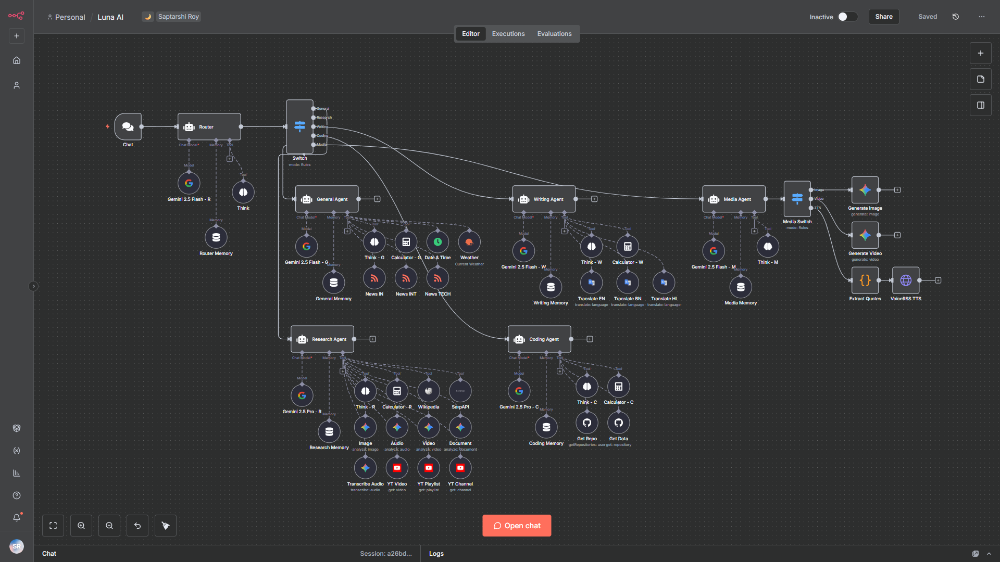

<h1 align="center"><b>Luna AI</b></h1>

  <a href="https://github.com/saptarshiroy39/Luna-AI"><b>Luna AI</b></a> is an intelligent multi-agent AI system built with <a href="https://n8n.io"><b>n8n</b></a> that provides specialized assistance across different domains through smart routing and dedicated agents. Powered by Google Gemini AI models, Luna delivers comprehensive help for research, coding, writing, general queries, and media generation—all through a unified conversational interface.

---

## ✨ Features

| FEATUREs                           | DESCRIPTION                                                                     | TECHNOLOGY                                  |
|------------------------------------|---------------------------------------------------------------------------------|---------------------------------------------|
| 🤖 **Intelligent Agent Routing**  | Smart query classification and routing to 6 specialized AI agents               | ***Gemini 2.5 Flash***                      |
| 🔍 **Advanced Research**          | Real-time web search, Wikipedia access, and multi-source analysis               | ***SerpAPI***, ***Wikipedia Tool***         |
| 🎥 **YouTube Integration**        | Analyze videos, playlists, and channels with detailed metadata extraction       | ***YouTube API***                           |
| 💻 **Code Development**           | Multi-language programming assistance, debugging, and GitHub integration        | ***GitHub API***, ***Gemini 2.5 Pro***      |
| ✍️ **Content Creation**           | Blog posts, articles, creative writing, and professional communications         | ***Gemini 2.5 Flash***                      |
| 🌐 **Multi-Language Translation** | Seamless translation between English, Bengali, and Hindi                        | ***Google Translate API***                  |
| 🎨 **AI Media Generation**        | Create custom images and videos on-demand                                       | ***Nano Banana***, ***Veo 3.0***            |
| 🎙️ **Text-to-Speech**             | Natural voice synthesis for any text content                                    | ***VoiceRSS API***                          |
| 👥 **Multi-Modal Analysis**       | Process and analyze images, audio, video, and documents                         | ***Gemini Tools***                          |
| 🌦️ **Weather & News**             | Real-time weather updates and curated news headlines                            | ***OpenWeatherMap***, ***Google News RSS*** |
| 🧠 **Contextual Memory**          | 20-message conversation buffers maintain context across interactions            | ***Built-in***                              |
| 🧮 **Smart Tools**                | Built-in calculator, date/time queries, and step-by-step reasoning capabilities | ***Built-in***                              |

---

## 🤖 Agent System Overview

Luna AI uses a sophisticated multi-agent architecture with intelligent routing:

---

## ⚙️ Agent Components

| #   | AGENTs             | DESCRIPTION                                                                                   | AI MODELs                                            |
|-----|--------------------|-----------------------------------------------------------------------------------------------|------------------------------------------------------|
| 1️⃣ | **Router Agent**   | Analyzes user input and intelligently routes queries to the appropriate specialized agent     | ***Gemini 2.5 Flash***                               |
| 2️⃣ | **General Agent**  | Handles everyday conversations, weather, news, calculations, and general assistance           | ***Gemini 2.5 Flash***                               |
| 3️⃣ | **Research Agent** | Performs in-depth web research, Wikipedia lookups, YouTube analysis, and many other tasks     | ***Gemini 2.5 Pro***                                 |
| 4️⃣ | **Coding Agent**   | Provides coding assistance, debugging, GitHub integration, and multi-language code generation | ***Gemini 2.5 Pro***                                 |
| 5️⃣ | **Writing Agent**  | Creates content, handles translations (EN/BN/HI), and produces creative writing               | ***Gemini 2.5 Flash***                               |
| 6️⃣ | **Media Agent**    | Generates images, videos, and text-to-speech, plus classifies media generation requests       | ***Nano Banana***, ***Veo 3.0***, ***VoiceRSS API*** |

---

  Made with <a href="https://n8n.io">n8n</a> by Saptarshi Roy

